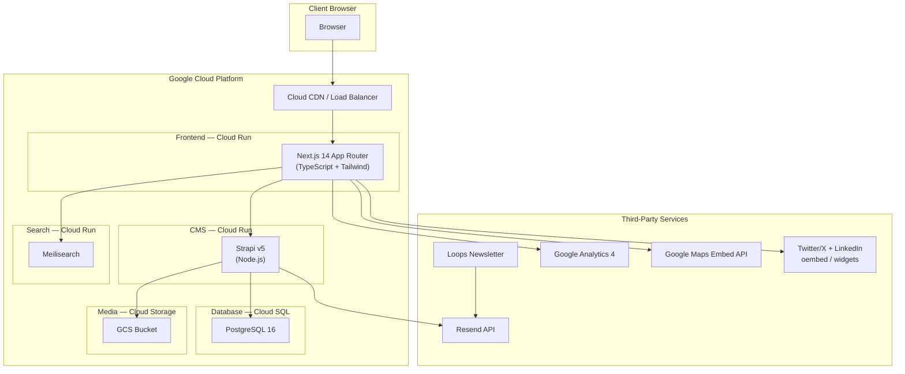

# Software Architecture Document (SAD)

**Institute of Ethics — Website**

Target audience: developers. This document defines technical requirements, architecture, data models, and integration patterns so the project can be implemented and maintained without ambiguity.

---

## 1. Overview

### Purpose

The Institute of Ethics website is a full-stack, content-driven site that presents the institute's mission, research, education, outreach, events, publications, team, and engagement opportunities. The SAD specifies how the frontend (Next.js), CMS (Strapi), search (Meilisearch), email (Resend + Loops), and infrastructure (GCP) work together.

### Scope

- **In scope**: Public website (24 routes including detail pages), Strapi CMS with 10 content types, site-wide search, contact/newsletter/partnership forms, Google Maps embed, social media feeds on News, GA4 analytics, deployment and CI/CD on GCP.
- **Out of scope**: Custom admin portal (Strapi admin UI only), content migration (client populates fresh), membership portal, multilingual support.

### Project Summary

| Layer | Technology |
|-------|------------|
| Frontend | Next.js 14 App Router, TypeScript, Tailwind CSS |
| CMS | Strapi v5 (Node.js), REST API |
| Database | PostgreSQL 16 (Cloud SQL) |
| Search | Meilisearch (self-hosted on GCP) |
| Email | Resend (transactional), Loops (newsletter) |
| Analytics | Google Analytics 4 |
| Hosting | Google Cloud Platform (Cloud Run, Cloud SQL, GCS, CDN) |

---

## 2. System Architecture

- **Browser** → **Cloud CDN / Load Balancer** → **Next.js** (frontend). Next.js fetches content from Strapi and search from Meilisearch; loads GA4, Maps, and social widgets client-side.
- **Strapi** reads/writes **PostgreSQL** and uploads media to **GCS**. Strapi does not call Resend directly; Next.js API routes send transactional emails via Resend. Loops manages newsletter audiences and may use Resend for delivery depending on Loops configuration.
- All production secrets (DB, API keys) live in GCP Secret Manager.

---

## 3. Tech Stack

| Category | Technology | Version / Notes |
|----------|------------|------------------|
| Frontend | Next.js | 14.x App Router |
| Frontend | React | 18.x |
| Frontend | TypeScript | 5.x |
| Frontend | Tailwind CSS | 3.4.x |
| CMS | Strapi | v5 (Node 20 LTS) |
| Database | PostgreSQL | 16 (Cloud SQL) |
| Search | Meilisearch | Latest stable (Docker on Cloud Run) |
| Transactional email | Resend | REST API |
| Newsletter | Loops | REST API (contacts + audience) |
| Analytics | Google Analytics | GA4 |
| Maps | Google Maps | Embed API |
| Media storage | Google Cloud Storage | Standard bucket, CDN in front |
| Hosting | Google Cloud Run | Next.js, Strapi, Meilisearch |
| CI/CD | Cloud Build | Build + deploy on push to main |
| Container registry | Artifact Registry | Docker images |

---

## 4. Frontend Architecture

### 4.1 App Router Structure

All pages live under `src/app/`. Layout and design follow [00-design-system.md](00-design-system.md), [00-navigation-architecture.md](00-navigation-architecture.md), and the page/component specs in `spec/pages/` and `spec/components/`.

- **Root layout** (`app/layout.tsx`): Header, Footer, skip link, GA4 script, fonts (Cormorant Garamond, Source Sans 3).
- **Route groups**: Flat structure; no route groups. Dynamic segments: `[slug]` for news, publications, events.

### 4.2 Component Hierarchy

- **Layout**: `Header`, `Footer`, `Navigation`, `MobileMenu`, `Breadcrumbs` (see [layout-components.md](components/layout-components.md)).
- **Sections**: `Hero`, `MissionStatement`, `HighlightsSection`, `NewsSection`, `EventsSection`, `PublicationsGrid`, `TeamGrid`, `NewsletterSignup`, `EventCard` (see [section-components.md](components/section-components.md)).
- **UI**: `Button`, `Card` (and subcomponents), `Input`, `Textarea`, `Select`, `Modal`, `SearchBar` (see [ui-components.md](components/ui-components.md)).

Composition: Page → Layout + Section components → UI components. No direct raw HTML for branded elements.

### 4.3 Data Fetching

- **Server components**: Default. Fetch from Strapi REST in server components via a shared client in `src/lib/api.ts` (e.g. `getNewsArticles()`, `getPublicationBySlug()`). Use `fetch` with `next: { revalidate: 60 }` (or equivalent) for ISR.
- **Client components**: Used for `/search` (Meilisearch client), forms (contact, newsletter, partnership), and social/Maps embeds. Mark with `"use client"` only where needed.
- **Placeholder data**: Remove or gate `src/lib/data.ts`; production uses Strapi only. Optional: keep `data.ts` for storybook or local dev without Strapi.

### 4.4 Rendering Strategy

| Page type | Strategy | Rationale |
|-----------|----------|-----------|
| Static (About, Vision, History, Research overview, Outreach overview, Engage, Contact) | Static | No CMS data; build-time HTML. |
| Content list/detail (Home, Team, Research areas/publications/speaker-series, Education, Events, Symposium, News) | ISR | Strapi-backed; revalidate 60–300s. |
| Search | Dynamic (client) | Meilisearch query at request time. |
| API routes (newsletter, contact, partnership) | Dynamic | Server-side only; no static export for these. |

Next.js config: remove `output: 'export'` for production; use default Node/server rendering so ISR and API routes work. Static export can remain for a separate static/preview build if required.

---

## 5. CMS Architecture (Strapi v5)

### 5.1 Roles and Permissions

- **Admin**: Full access (content, media, users, settings, API tokens).
- **Editor**: Create, update, delete content and media; no access to settings, users, or API tokens.
- Public API: read-only for all content types; no authentication required for GET. Write (POST/PUT/DELETE) requires API token; only backend/Next.js uses tokens, not the browser.

### 5.2 Content Types

| Content Type | Description | Key Fields |
|--------------|-------------|------------|
| **NewsArticle** | News and announcements | title (string), slug (uid), excerpt (text), content (richtext), author (string), category (enum or relation), featuredImage (media), publishedAt (datetime) |
| **Publication** | Research outputs | title, slug, abstract (text), authors (text), pdfFile (media), type (enum), topic (enum), year (integer), thumbnail (media) |
| **Event** | Events and symposium entries | title, slug, date (datetime), location (string), description (text), registrationLink (string), image (media) |
| **TeamMember** | Team/leadership bios | name, title, bio (text), photo (media), order (integer) |
| **ResearchArea** | Research focus areas | title, description, order (integer) |
| **SpeakerSeriesEntry** | Speaker series / collaborations | title, date (datetime), description (text) |
| **SymposiumEntry** | Symposium editions | year (integer), title, description (text), isPast (boolean) |
| **EducationProgram** | Programs and offerings | title, description (text) |
| **LearningResource** | Links to syllabi, modules | title, url (string) |
| **SiteSettings** | Singleton for home/global | heroTitle, heroSubtitle, heroImage, missionText, missionImage |

- All list content types have `createdAt` / `updatedAt`. Use `publishedAt` where draft/publish is needed (e.g. NewsArticle).
- Slugs: use Strapi UID or a custom slug field; must be unique per content type for detail routes.

### 5.3 API

- **Strapi REST**: Use REST API only (no GraphQL). Base URL from env (e.g. `STRAPI_URL`).
- **Endpoints**: `/api/news-articles`, `/api/publications`, `/api/events`, `/api/team-members`, `/api/research-areas`, `/api/speaker-series-entries`, `/api/symposium-entries`, `/api/education-programs`, `/api/learning-resources`, `/api/site-setting` (singular).
- **Query params**: `populate=*` or explicit populate for media/relations; `filters`, `sort`, `pagination` as per Strapi v5.
- **Next.js**: Centralized client in `src/lib/api.ts` that builds URLs and uses `fetch` with revalidation. No Strapi SDK in the browser.

### 5.4 Media

- **Provider**: `@strapi/provider-upload-google-cloud-storage`. Uploads go to a GCS bucket; public read via bucket policy or CDN.
- **URLs**: Strapi returns media URLs pointing to GCS (or CDN). Next.js `next/image` uses `remotePatterns` for these domains.

---

## 6. Search Architecture (Meilisearch)

### 6.1 Indexes

- **news_articles**: title, excerpt, content (strip HTML), slug, category, publishedAt. Searchable: title, excerpt, content. Filterable: category.
- **publications**: title, abstract, authors, slug, type, topic, year. Searchable: title, abstract, authors. Filterable: type, topic, year.
- **events**: title, description, slug, date, location. Searchable: title, description, location. Filterable: date (or year).

### 6.2 Index Sync

- **Source of truth**: Strapi. On create/update/delete of NewsArticle, Publication, Event, call Meilisearch API to add/update/remove the document.
- **Implementation**: Strapi lifecycle hooks (`afterCreate`, `afterUpdate`, `afterDelete`) or a small internal job that runs on content change and pushes to Meilisearch. Meilisearch runs as a separate Cloud Run service; Strapi uses Meilisearch API key (stored in Secret Manager).

### 6.3 Frontend Search

- **Page**: `/search`. Query from `searchParams.q`. Client component fetches from Meilisearch (search endpoint) with `meilisearch-js`; display results grouped or mixed (e.g. by type). No SSR for results; optional loading skeleton.
- **Filters**: If needed, pass filter query to Meilisearch (e.g. by content type). Header SearchBar submits to `/search?q=...`.

---

## 7. Email and Newsletter

### 7.1 Newsletter Signup

- **Flow**: User submits email on Engage page (or footer). Next.js API route `POST /api/newsletter` receives email, validates, then calls Loops API to add/update contact in the audience.
- **Loops**: Use Loops REST API (e.g. create or update contact, add to audience). No Resend call for signup; Loops handles campaigns.

### 7.2 Contact and Partnership Forms

- **Contact**: `POST /api/contact`. Body: name, email, subject (dropdown), message. Next.js validates, then calls Resend `emails.send()` to send to institute inbox; optional auto-reply via Resend.
- **Partnership**: `POST /api/partnership`. Body: name, email, organization, message. Same pattern: Resend to institute and optional confirmation.
- **Templates**: Use Resend React Email templates or simple HTML. Recipient address and Resend API key from env (Secret Manager in prod).

---

## 8. Analytics

- **GA4**: Add gtag.js via `next/script` in root layout. GA4 measurement ID from env.
- **Page views**: Default page_view; no extra code if using App Router with default behavior.
- **Events**: Track PDF downloads (outbound link or custom event), newsletter signup success, contact/partnership form submit. Use `gtag('event', ...)` from a client-side helper.

---

## 9. Social Media and Maps

### 9.1 News Page Feeds

- **Twitter/X**: Embed timeline widget via official script (client component). Load script when section is in view or on mount; do not block initial paint.
- **LinkedIn**: Page embed via LinkedIn embed script (client component). Same lazy-load approach.
- **Implementation**: Wrapped in `<Suspense>` with a placeholder. URLs or handles for Twitter and LinkedIn from env or Strapi (e.g. SiteSettings).

### 9.2 Contact Page Map

- **Google Maps Embed API**: One embed (iframe) showing institute address. API key from env; restrict key to Embed API and domain. Client or server component is fine; iframe src built with address query.

---

## 10. Infrastructure (GCP)

### 10.1 Services

| Service | Purpose |
|---------|---------|
| Cloud Run (service: frontend) | Serves Next.js (Node server). Min instances 0; max as needed. |
| Cloud Run (service: strapi) | Serves Strapi admin and API. Min 0 or 1 if preferred. |
| Cloud Run (service: meilisearch) | Runs Meilisearch container. Persistent index via volume or startup sync from Strapi. |
| Cloud SQL (PostgreSQL 16) | Strapi database. Private IP preferred; Cloud Run VPC connector if needed. |
| Cloud Storage (bucket) | Media uploads from Strapi. Public read or behind CDN. |
| Cloud CDN | Caches responses from frontend (and optionally GCS). |
| Load Balancer | HTTPS term, managed cert, routes to Cloud Run frontend. |
| Artifact Registry | Docker images for Next.js, Strapi, Meilisearch. |
| Secret Manager | DB password, Strapi admin JWT secret, API keys (Resend, Loops, Meilisearch, Maps, GA4). |
| Cloud Build | Builds images, runs migrations, deploys to Cloud Run. |

### 10.2 Environments

- **Production**: Single project or separate project; secrets and env injected from Secret Manager at deploy time.
- **Staging**: Optional; same architecture, separate Cloud Run services and DB (or separate project).

---

## 11. CI/CD

- **Trigger**: Push to `main` (or release branch). Cloud Build trigger.
- **Steps**:
  1. Checkout repo.
  2. Run tests (e.g. `npm run build`, `npm run lint` for frontend).
  3. Build Docker images for Next.js, Strapi, Meilisearch (if custom image).
  4. Push images to Artifact Registry.
  5. Run Strapi DB migrations (e.g. via Strapi script or Cloud Run job).
  6. Deploy Cloud Run services (frontend, strapi, meilisearch) with new images and secrets.
- **Migrations**: Strapi migrations in repo; run before or during Strapi deploy. No manual DB changes in production.

---

## 12. Security

- **HTTPS**: Enforced at Load Balancer; redirect HTTP → HTTPS. Managed SSL certificate.
- **Strapi**: Admin and API only on HTTPS. Strong admin password policy. API token for server-to-server (Next.js → Strapi) stored in Secret Manager; never in client. Optional: IP allowlist for admin.
- **RBAC**: Admin and Editor only; no public sign-up. User management in Strapi admin.
- **Secrets**: All secrets in GCP Secret Manager. Cloud Run and Cloud Build reference secrets by name; no `.env` in repo.
- **CORS**: Strapi allows only the frontend origin(s). Next.js API routes same-origin or CORS as needed for server-only use.
- **Input**: Validate and sanitize all form inputs; Resend/Loops accept server-side only. Rate limit contact/newsletter/partnership endpoints (e.g. via Cloud Run or API gateway).

---

## 13. Performance

- **ISR**: Content pages use `revalidate` (e.g. 60–300s) so updates from Strapi appear without full rebuild.
- **CDN**: Cloud CDN in front of Next.js and GCS; cache static assets and ISR responses.
- **Images**: Served from GCS; optimize via Strapi or Next.js image optimization; `next/image` with `remotePatterns` for GCS host.
- **Search**: Meilisearch typically &lt; 50ms; debounce search input on `/search` to limit requests.

---

## 14. Page and API Inventory

| Route | Rendering | Data Source |
|-------|-----------|-------------|
| `/` | ISR | Strapi (news, events, publications, research areas, site settings) |
| `/about` | Static | None |
| `/about/vision` | Static | None |
| `/about/history` | Static | None |
| `/about/team` | ISR | Strapi (TeamMember) |
| `/research` | Static | None |
| `/research/areas` | ISR | Strapi (ResearchArea) |
| `/research/publications` | ISR | Strapi (Publication) |
| `/research/publications/[slug]` | ISR | Strapi (Publication by slug) |
| `/research/speaker-series` | ISR | Strapi (SpeakerSeriesEntry) |
| `/education` | ISR | Strapi (EducationProgram, LearningResource) |
| `/outreach` | Static | None |
| `/outreach/events` | ISR | Strapi (Event) |
| `/outreach/events/[slug]` | ISR | Strapi (Event by slug) |
| `/outreach/symposium` | ISR | Strapi (SymposiumEntry) |
| `/news` | ISR | Strapi (NewsArticle) |
| `/news/[slug]` | ISR | Strapi (NewsArticle by slug) |
| `/engage` | Static | None |
| `/contact` | Static | None |
| `/search` | Dynamic (client) | Meilisearch |
| `POST /api/newsletter` | Dynamic | Loops API |
| `POST /api/contact` | Dynamic | Resend |
| `POST /api/partnership` | Dynamic | Resend |

---

## 15. References

- Design and UX: [spec/README.md](README.md), [00-design-system.md](00-design-system.md), [00-navigation-architecture.md](00-navigation-architecture.md), [components/](components/), [pages/](pages/).
- Strapi v5: Official docs for content types, REST API, lifecycle hooks, GCS provider.
- Next.js 14: App Router, Server Components, Route Handlers, ISR.
- GCP: Cloud Run, Cloud SQL, GCS, Secret Manager, Cloud Build.
